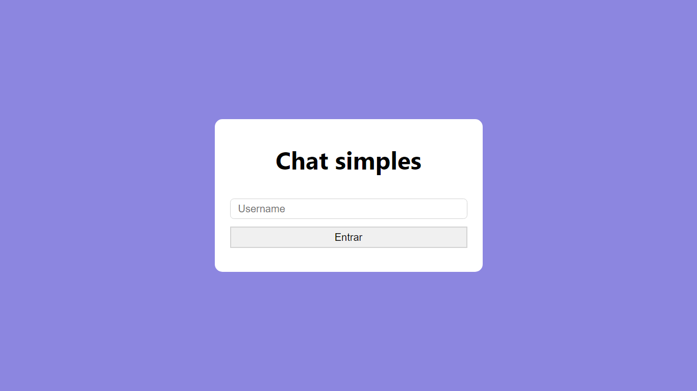

# Chat simples - frontend

Esse projeto consiste em um chat simples, que se utiliza do protocolo websocket para receber mensagem de um pessoa e retransmiti-las para todas as outras pessoas conectadas.

<b>Tela de inicial</b>

<b>Tela de chat</b>

Este projeto está licenciado sob a [Licença MIT](LICENSE).